# Git Project (Project2)

Git is a distributed version control system that tracks changes in any set of computer files, usually used for coordinating work among programmers who are collaboratively developing source code during software development. Its goals include speed, data integrity, and support for distributed, non-linear workflows.

### Initializing a Git Repository
Before initializing a git repo, you must have installed Git in your local device.

Click on this [Install Git](https://git-scm.com/downloads). Choose your operating system, download and install git on your device.

Now to initialize a git repo, follow the steps;

- Open a terminal on your computer, e.g git bash
- On your terminal, create a working folder or directory e.g DevOps folder using this command `mkdir DevOps`
- Change or move into your working directory or folder using this command `cs DevOps`
- While you are inside the folder, run `git init` command.

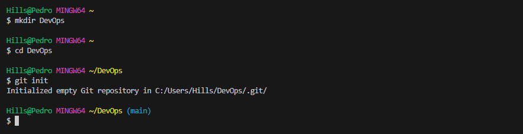

## Making your first commit

Commits are the core building block units of a Git project timeline. Commits can be thought of as snapshots or milestones along the timeline of a Git project. Commits are created with the git commit command to capture the state of a project at that point in time.

Follow these steps to make your commit:

- Inside your working directory create a file index.txt using this command `touch index.txt`

- Write any sentence of your choice inside the text file. Afterward, save your changes.

- Add your changes to git staging area using this command `git add .`

- To commit your changes to git, run the command `fit commit -m "first commit"` 

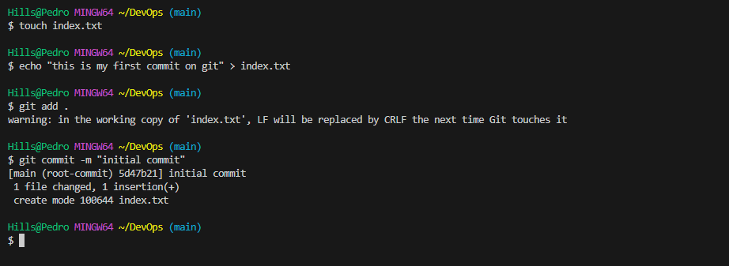

The -m flag is used to provide a commit message. The commit message is a nice way to provide context about the commit. When writing a commit message, make it descriptive as possible. Let it explain why the commit was made.

## **Working with Branches**

In Git, branches are a part of your everyday development process. Git branches are effectively a pointer to a snapshot of your changes. When you want to add a new feature or fix a bug—no matter how big or how small—you spawn a new branch to encapsulate your changes.
Git branch is also an important tool for collaboration within remote teams(developers working from different location). They can make separate branches while working on same feature and later converge the code to one branch.

## Make your first git Branch

To make a new branch, run this command: `git checkout -b`

The -b flag helps to create and change into the new branch.

Make a new branch by running this command `git checkout -b branch-name`

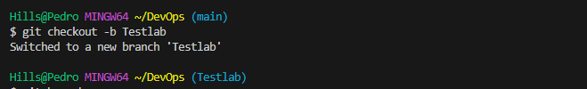

### Listing your git Branches

Use the command below to list the branches on your local git repository

`git branch`

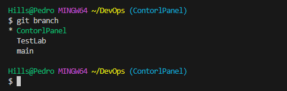

### Change into an Old Branch

To change into an old branch, use the command below:

`git checkout <branch name>`

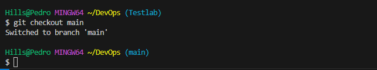

### Merging a Branch into another Branch

To merge branches locally, use git checkout to switch to the branch you want to merge into. This branch is typically the main branch. Next, use git merge and specify the name of the other branch to bring into this branch.

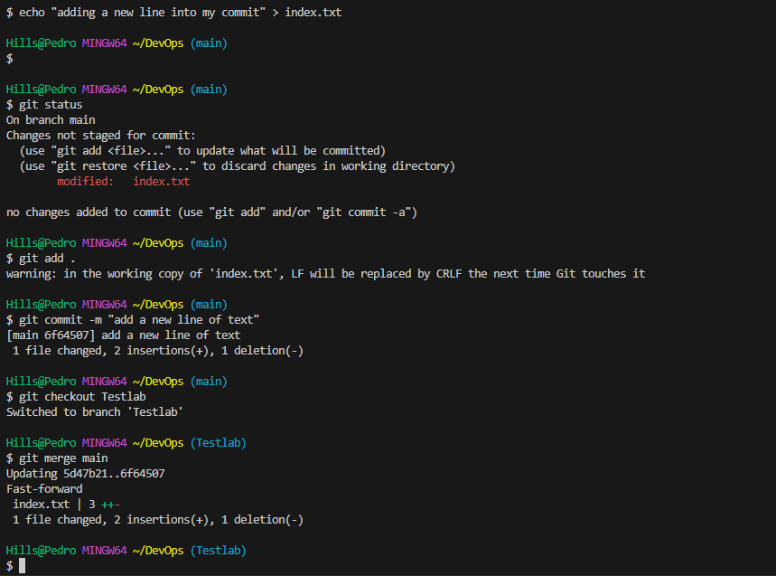

### Deleting a git branch

Git branch can be deleted with the command below:

`git branch -d <branch_name>`

To learn more, type this command `git branch --help`

## **Collaboration and Remote Repositories**

### Collaboration and Remote Repositories

To be able to collaborate on any Git project, you need to know how to manage your remote repositories. Remote repositories are versions of your project that are hosted on the Internet or network somewhere.

As you make changes to your project locally, you can keep them up-to-date with your remote repository. In Git, a remote is the server where your code is stored. In your case, that server is a repository on GitHub or GitHub Enterprise. 

GitHub is a code hosting platform for version control and collaboration. It lets you and others work together on projects from anywhere.

### Creating a Github Account

step 1: Head over to [join github.com](https://github.com/)

step 2: Next enter your username, password and email

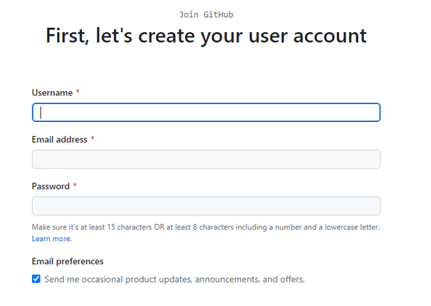

step 3: Click on the verification button to verify your identity

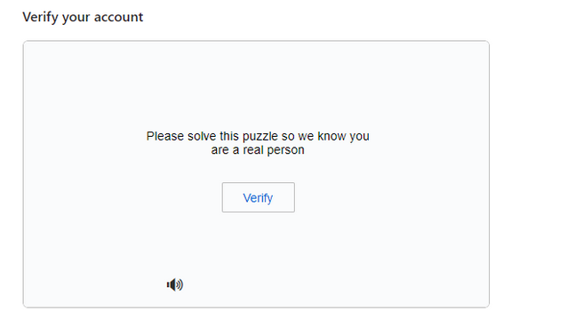

step 4: Click on the Create button to create your account

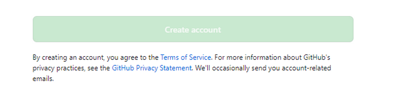

step 5: An activation code will be sent to your email, enter the code in the textboxes provided and click continue.

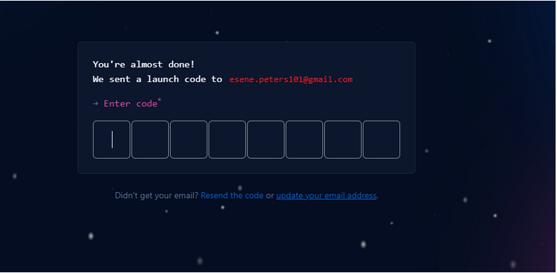

step 6: Select your preference and click continue

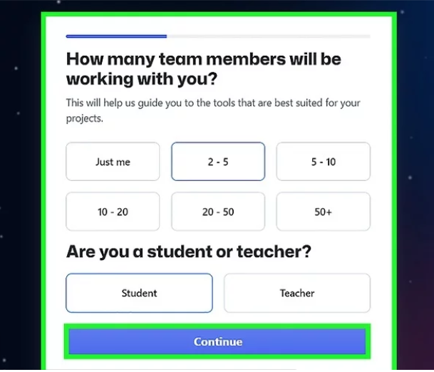

step 7: A list of github plan will be shown to you. Click continue for free.

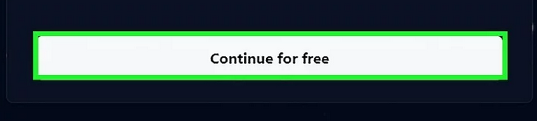

### Creating your first Repository

step 1: Click on the plus sign at the top right corner of your github account. A drop down menu will appear, select new repository

step 2: fill out the form by add a unique repository name, description and ticking the box to add a Readme.md file

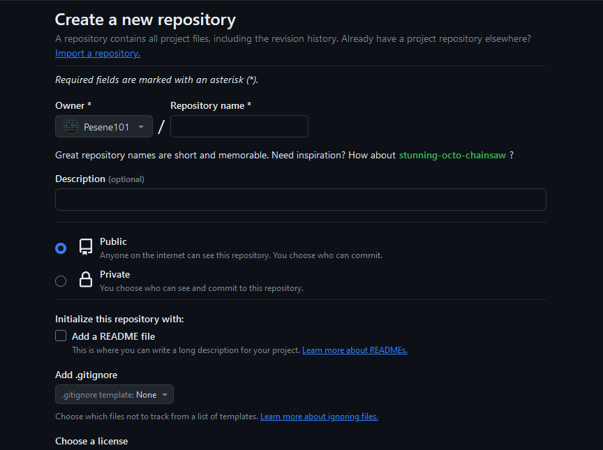

step 3: Click the green button below to create your repository

## Pushing your LOCAL git Repository to your Remote github Repository

Create a new, local Git branch in your repository. Perform a git push origin -u <branchname> command to push to the remote repo. Continue to perform Git commits locally on the new branch. Simply use the git push origin command on subsequent pushes of the new branch to the remote repo

- Add a remote repository to the local repository using the code below:

`git remote add origin <link to your github repo>`

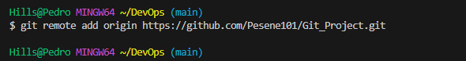

To get the remote link, click the green button code, copy the http link. A screenshot is shown below.

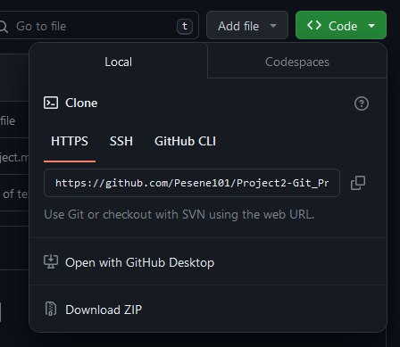

- After commiting your changes to your local repo, you push the content to the remote repo using the command below:

`git push origin <branch name>`

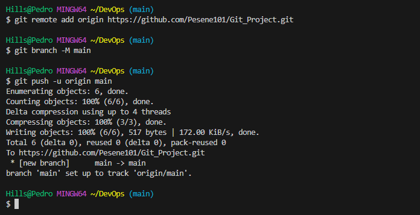

The word origin refer to your remote repo link, it evaluates to the remote repo url. it can be any word you choose.

## Cloning Remote Git Repository

Cloning a repository

    On GitHub.com, navigate to the main page of the repository.
    Above the list of files, click Code.
    Copy the URL for the repository. ...
    Open TerminalTerminalGit Bash.
    Change the current working directory to the location where you want the cloned directory.

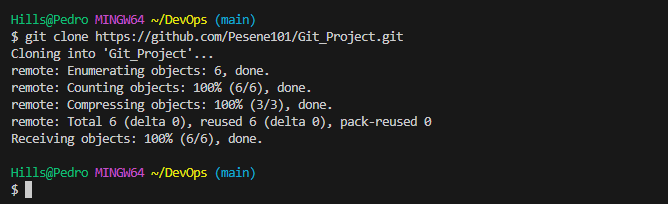

## Branch Management And Tagging
### Introduction to Markdown Syntax

Markdown's syntax is intended for one purpose: to be used as a format for writing for the web. Markdown is not a replacement for HTML, or even close to it. Its syntax is very small, corresponding only to a very small subset of HTML tags. The idea is not to create a syntax that makes it easier to insert HTML tags.

Here are the most commonly used markdown syntax elements:

1. Headings: To create headings, use the hash symbol at the beginning of the line. The number of hash symbols used indicates the level of the heading.

`# Heading 1`

`## Heading 2`

`### Heading 3`

2. Emphasis: Asterisks or underscore are used to emphasize text

`*italic* or _italic_`

`**bold** or __bold__`

3. List: Markdown has support for both ordered and unordered list

unordered list example:

`- item 1`

`- item 2`

`- item 3`

ordered list example:

`1. First item`

`2. First item`

`3. First item`

4. Links: to create a hyperlink, use square brackets for the text followed by parenthesis containing the url.

`[google](https://www.google.com)`

5. Images: To display an image, use an exclamation mark followed by the square bracket for the alt text and parenthesis containing the image url.

``

6. Code: To display code or code snippets, use backticks (``) to enclose the code:

example:

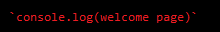

Like i earlier mentioned, these are the most commonly used markdown syntax element. To learn more, visit the link [markdown documentation](https://learn.microsoft.com/en-us/contribute/content/markdown-reference).rm 