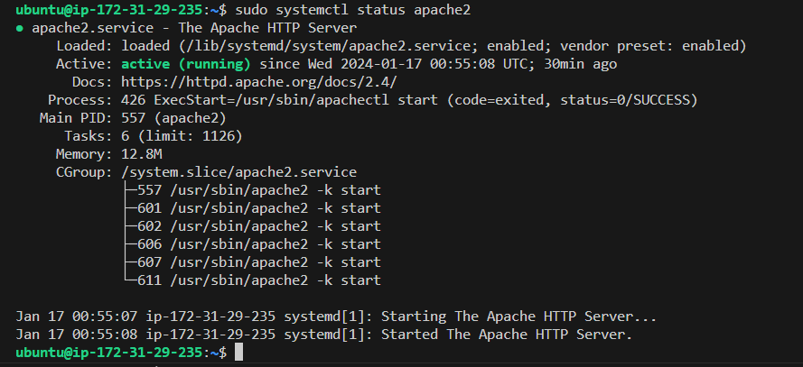
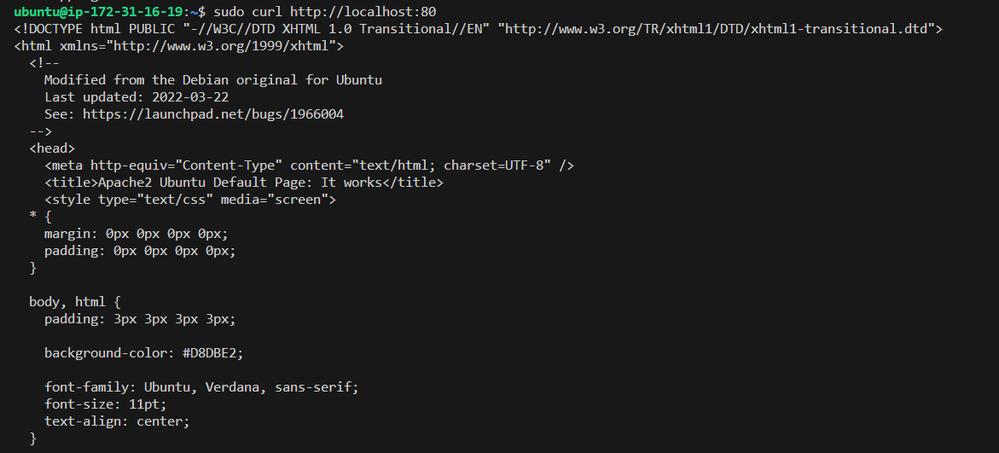
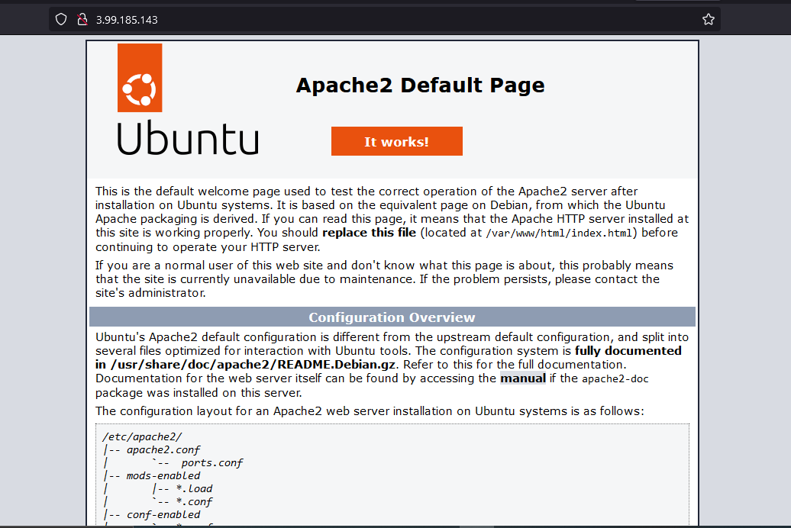

## Documentation For AWS LAMP STACK IMPLEMENTATION
# This Project shows how to implement LAMP(Linux,Apache,Mysql,PhP) Stack on AWS

A LAMP stack is a bundle of four different software technologies that developers use to build websites and web applications. LAMP is an acronym for the operating system, Linux; the web server, Apache; the database server, MySQL; and the programming language, PHP.

    Linux: The operating system. Linux is a free and open source operating system (OS) that has been around since the mid-1990s.

    Apache: The web server. The Apache web server processes requests and serves up web assets via HTTP so that the application is accessible to anyone in the public domain over a simple web URL. 

    MySQL: The database. MySQL is an open source relational database management system for storing application data. With My SQL, you can store all your information in a format that is easily queried with the SQL language. 

    PHP: The programming language. The PHP open source scripting language works with Apache to help you create dynamic web pages. 

Follow the links below to install some dependencies before lunching the ubuntu virtual machine on your device.

- [Install OpenSSH](https://learn.microsoft.com/en-us/windows-server/administration/openssh/openssh_install_firstuse?tabs=powershell#tabpanel_1_powershell)

- [OpenSSH Key Management](https://learn.microsoft.com/en-us/windows-server/administration/openssh/openssh_keymanagement#user-key-generation)

By installing these dependencies, your device will be authenticated to have access to the server and github easily.

After launching the Ubuntu Virtual machine on AWS Account, install Apache2 using the Ubuntu package manager 'apt';

**`sudo apt update`**

**`sudo apt install apache2`**

To verify that apache2 is running as a server, use the following command;

**`sudo systemctl status apache2`**

This is the outcome of the above command.

To verify locally in your ubuntu shell, run the following command;

`$ curl http://localhost:80
or
$ curl http://127.0.0.1:80
`

Now its' time to test if the apache2 http server can respond to a web request. Open a web browser of your choice and try to access the following url;
**`http://<Public-ip-Address>:80`**

# --------**Installing MySql**----------
