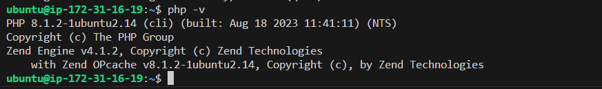
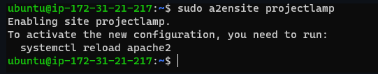
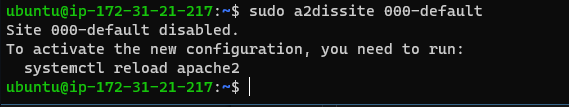
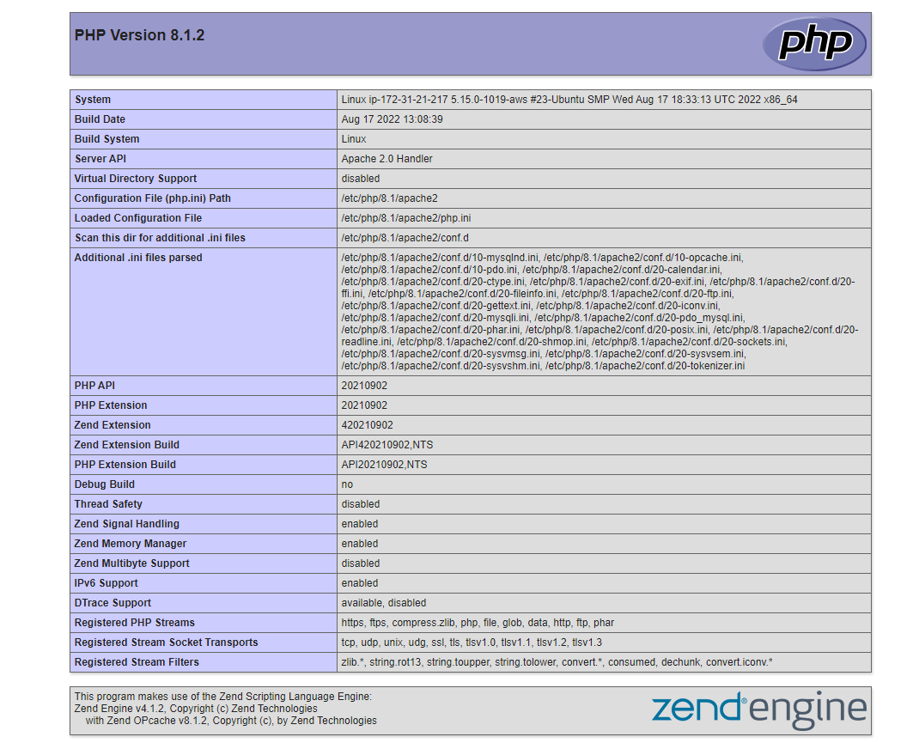

## Documentation For AWS LAMP STACK IMPLEMENTATION
# This Project shows how to implement LAMP(Linux,Apache,Mysql,PhP) Stack on AWS

A LAMP stack is a bundle of four different software technologies that developers use to build websites and web applications. LAMP is an acronym for the operating system, Linux; the web server, Apache; the database server, MySQL; and the programming language, PHP.

    Linux: The operating system. Linux is a free and open source operating system (OS) that has been around since the mid-1990s.

    Apache: The web server. The Apache web server processes requests and serves up web assets via HTTP so that the application is accessible to anyone in the public domain over a simple web URL. 

    MySQL: The database. MySQL is an open source relational database management system for storing application data. With My SQL, you can store all your information in a format that is easily queried with the SQL language. 

    PHP: The programming language. The PHP open source scripting language works with Apache to help you create dynamic web pages. 

Follow the links below to install some dependencies before lunching the ubuntu virtual machine on your device.

- [Install OpenSSH](https://learn.microsoft.com/en-us/windows-server/administration/openssh/openssh_install_firstuse?tabs=powershell#tabpanel_1_powershell)

- [OpenSSH Key Management](https://learn.microsoft.com/en-us/windows-server/administration/openssh/openssh_keymanagement#user-key-generation)

By installing these dependencies, your device will be authenticated to have access to the server and github easily.

After launching the Ubuntu Virtual machine on AWS Account, install Apache2 using the Ubuntu package manager 'apt';

**`sudo apt update`**

**`sudo apt install apache2`**

To verify that apache2 is running as a server, use the following command;

**`sudo systemctl status apache2`**


This is the outcome of the above command.

To verify locally in your ubuntu shell, run the following command;

`$ curl http://localhost:80
or
$ curl http://127.0.0.1:80
`


Now its' time to test if the apache2 http server can respond to a web request. Open a web browser of your choice and try to access the following url;
**`http://<Public-ip-Address>:80`**


# --------**Installing MySql**----------

Installing Mysql on your Ubuntu server. Follow the command bellow;

 **`$ sudo apt install mysql-server -y`**
  
`-y` allows the installation proceed without seeking for confirmation

Log into the MySQL console

**`sudo mysql`**

configure a database user on and set login password for Mysql

**`ALTER USER 'root'@'localhost' IDENTIFIED WITH mysql_native_password BY 'PassWord.1';`**

Exit the shell with **`Exit`**

Start MYSQL Interactive script, this will prompt you to configure the validate password plugin.

**`sudo mysql_secure_installation`**

Confirm ability to login to Mysql by running the commmand.

**`sudo mysql -p`**

To exit the MySQL console, type:

**`mysql> exit`**


Log into the MySQL console

**`sudo mysql`**

configure a database user on and set login password for Mysql

**`ALTER USER 'root'@'localhost' IDENTIFIED WITH mysql_native_password BY 'PassWord.1';`**

Exit the shell with **`Exit`**

Start MYSQL Interactive script, this will prompt you to configure the validate password plugin.

**`sudo mysql_secure_installation`**

Confirm ability to login to Mysql by running the commmand.

**`sudo mysql -p`**

To exit the MySQL console, type:

**`mysql> exit`**

# -----------Installing PHP ---------------

After successfully installing Apache2 and MySql, it's time to install `php`. PHP installation on Ubuntu systems is pretty straightforward. You just need to add the required PPA and you can install any PHP version on the Ubuntu system.

We will install 3 packages namely `php`, `libapache2-mod-php`, `php-mysql`. run this command to install all packages listed.

**`sudo apt install php libapache2-mod-php php-mysql`**

Once the installation is complete, run the command below to confirm the version of `php`

**`php -v`**


At this point we have successfully installed all 4 applications that make up the lamp stack

- Linux
- Apache Http Server
- MySQL
- PHP

# How To Set Up Apache Virtual Hosts on Ubuntu

The first step is to create a directory structure that will hold the site data that you will be serving to visitors.

Your document root, the top-level directory that Apache looks at to find content to serve, will be set to individual directories under the /var/www directory. You will create a directory here for each of the virtual hosts.

Create the directory for projectlamp using the mkdir command as stated below;

`sudo mkdir /var/www/projectlamp`

You’ve created the directory structure for your files, but they are owned by the root user. If you want your regular user to be able to modify files in these web directories, you can change the ownership with these commands:

`sudo chown -R $USER:$USER /var/www/projectlamp`

After that, create and open a new configuration file in Apache's `sites-available` directory using your preferred command line editor. Here, we'll be using the `vi` or `vim` editor

`sudo vi /etc/apache2/sites-available/projectlamp.conf`

This will create a new blank file. Paste in the following bare-bones configuration by hitting on `i` on the keyboard to enter the insert mode and paste the text;
`<VirtualHost *:80>
    ServerName projectlamp
    ServerAlias www.projectlamp 
    ServerAdmin webmaster@localhost
    DocumentRoot /var/www/projectlamp
    ErrorLog ${APACHE_LOG_DIR}/error.log
    CustomLog ${APACHE_LOG_DIR}/access.log combined
</VirtualHost>`

To save and close a file, simple follow the following steps;

1. hit the `esc` button on the keyboard
2. type `:`
3. type `wq`. W for `write`, q for `quit`
4. hit `enter` to save the file

To view this created file, follow the command below;

`sudo ls /etc/apache2/sites-avavilable`

## Enabling the New Virtual Host Files

Now that you have created your virtual host files, you must enable them. Apache includes some tools that allow you to do this.

You’ll be using the a2ensite tool to enable each of your sites. If you would like to read more about this script, you can refer to the a2ensite documentation.

Use the following commands to enable your virtual host sites:

**`sudo a2ensite projectlamp`**



**`sudo a2dissite 000-default.conf`**



Next is to test for configuration errors

**`sudo apache2ctl configtest`**

When you are finished, restart Apache to make these changes take effect.

**`sudo systemctl restart apache2`**

Optionally, you can check the status of the server after all these changes with this command:

**`sudo systemctl status apache2`**

Your server should now be set up to serve two websites.

**Create an index file in the projectlamp folder.**
```
sudo echo 'Hello LAMP from hostname' $(curl -s http://169.254.169.254/latest/meta-data/public-hostname) > /var/www/projectlamp/index.html
```

Go to your browser and try to open your website URL using IP address:

**`http://<Public-IP-Address>:80`** 

Prefarrably you can also use the DNS name, the port is optional as it defaults to 80. 

**`http://<Public-DNS-Name>:80`**


## .............................ENABLE PHP ON THE WEBSITE.......................
---

With the default DirectoryIndex settings on Apache, the index.html file takes precedence, lets modify this and give precedence to the index.php file.

We need to edit the /etc/apache2/mods-enabled/dir.conf file and change the order in which the index.php file is listed within the DirectoryIndex directive:

**`sudo vim /etc/apache2/mods-enabled/dir.conf`**

```
<IfModule mod_dir.c>
        #Change this:
        #DirectoryIndex index.html index.cgi index.pl index.php index.xhtml index.htm
        #To this:
        DirectoryIndex index.php index.html index.cgi index.pl index.xhtml index.htm
</IfModule>
```

Save and close the file, The Apache service needs to be restarted for the changes to take effect.

**`sudo systemctl reload apache2`**

Create a new file named index.php inside the projectlamp root folder:

**`vim /var/www/projectlamp/index.php`**

```
<?php
phpinfo();
```
Refresh the webpage to get a display similar to the below screenshot.


It is advisable to remove the file as it contains sensitive information about your server and php site config.

**`sudo rm /var/www/projectlamp/index.php`**

Thank You!!