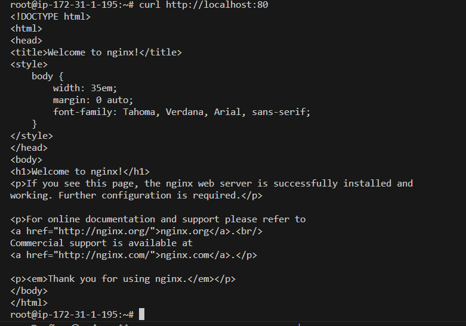
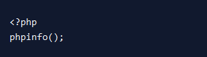

## Documentation For AWS LAMP STACK IMPLEMENTATION
# This Project shows how to implement LEMP(Linux,Nginx,Mysql,PhP) Stack on AWS

The LEMP software stack is a group of software that can be used to serve dynamic web pages and web applications. This is an acronym that describes a Linux operating system, with an Nginx (pronounced like “Engine-X”) web server. The backend data is stored in the MySQL database and the dynamic processing is handled by PHP.

This guide demonstrates how to install a LEMP stack on an Ubuntu 18.04 server. The Ubuntu operating system takes care of the first requirement. We will describe how to get the rest of the components up and running.

Before you complete this tutorial, you should have a regular, non-root user account on your server with `sudo` privileges. Set up this account by completing our [initial server setup guide for Ubuntu 18.04.](https://www.digitalocean.com/community/tutorials/initial-server-setup-with-ubuntu-18-04).

Once you have your user available, you are ready to begin the steps outlined in this guide.

## Step 1 – Installing the Nginx Web Server

In order to display web pages for your site visitors, you’re going to employ Nginx, a modern, efficient web server.

All of the software used in this procedure will come from Ubuntu’s default package repositories. This means you’ll use the `apt` package management suite to complete the necessary installations.

Since this is your first time using `apt` for this session, start off by updating your server’s package index:

`sudo apt update`

Next, install the server:

`sudo apt install nginx`

To verify that `niginx` was installed successfully and is running as a service in ubuntu, run the following command;

`sudo systemctl status nginx`


 Verify the web server is reachable from the localhost

```
 curl http://localhost:80

or

 curl http://127.0.0.1:80
 
```


Type the address that you receive in your web browser and it will take you to Nginx’s default landing page:

`http://<Public-IP-Address>:80`


## Step 2 – Installing MySQL to Manage Site Data

Now that you have a web server, you need to install MySQL (a database management system) to store and manage the data for your site.

Install MySQL by typing the following command:

`sudo apt install mysql-server`

The MySQL database software is now installed, but its configuration is not yet complete.

login to mysql

`sudo mysql`


We will run a security script that comes with Mysql to change some insecure default settings, but before then we are setting root password as shown below.

`ALTER USER 'root'@'localhost' IDENTIFIED WITH mysql_native_password BY 'PassWord.1'`

Exit Mysql.

`exit`

To secure the installation, MySQL comes with a script that will ask whether you want to modify some insecure defaults. Initiate the script by typing the following:

`sudo mysql_secure_installation`

This script will ask if you want to configure the `VALIDATE PASSWORD PLUGIN.`

```Warning: Enabling this feature is a judgment call. If enabled, passwords that don’t match the specified criteria will be rejected by MySQL with an error. This will cause issues if you use a weak password in conjunction with software that automatically configures MySQL user credentials, such as the Ubuntu packages for phpMyAdmin. It is safe to leave validation disabled, but you should always use strong, unique passwords for database credentials.```

Answer `Y` for yes, or anything else to continue without enabling.


```
VALIDATE PASSWORD PLUGIN can be used to test passwords and improve security. It checks the strength of password allows the users to set only those passwords which are secure enough. Would you like to setup VALIDATE PASSWORD plugin?

Press y|Y for Yes, any other key for No:
```
If you’ve enabled validation, the script will also ask you to select a level of password validation. Keep in mind that if you enter 2 – for the strongest level – you will receive errors when attempting to set any password which does not contain numbers, upper and lowercase letters, and special characters, or which is based on common dictionary words.

```There are three levels of password validation policy:

LOW    Length >= 8
MEDIUM Length >= 8, numeric, mixed case, and special characters
STRONG Length >= 8, numeric, mixed case, special characters and dictionary file

Please enter 0 = LOW, 1 = MEDIUM and 2 = STRONG: 1
```
Next, you’ll be asked to submit and confirm a root password:

```Please set the password for root here.

New password:

Re-enter new password:
```

For the rest of the questions, you should press Y and hit the ENTER key at each prompt. This will remove some anonymous users and the test database, disable remote root logins, and load these new rules so that MySQL immediately respects the changes we have made.

Note that in Ubuntu systems running MySQL 5.7 (and later versions), the root MySQL user is set to authenticate using the auth_socket plugin by default rather than with a password. This allows for some greater security and usability in many cases, but it can also complicate things when you need to allow an external program (e.g., phpMyAdmin) to access the user.

If using the auth_socket plugin to access MySQL fits with your workflow, you can proceed to Step 3. If, however, you prefer to use a password when connecting to MySQL as root, you will need to switch its authentication method from auth_socket to mysql_native_password. To do this, open up the MySQL prompt from your terminal:

`sudo mysql`

Next, exit MySQL user accounts uses with the following command:

`mysql> exit`

```
Note: After configuring your root MySQL user to authenticate with a password, you’ll no longer be able to access MySQL with the sudo mysql command used previously. Instead, you must run the following:
```
`mysql -u root -p`

```
After entering the password you set, you will receive the MySQL prompt.
```
At this point, your database system is now set up and you can move on to installing PHP.

## Step 3 – Installing PHP and Configuring Nginx to Use the PHP Processor

Nginx is now installed to serve your pages and MySQL is installed to store and manage your data. However, you still don’t have anything that can generate dynamic content. This is where PHP comes into play.

Since Nginx does not contain native PHP processing like some other web servers, you will need to install `php-fpm`, which stands for “fastCGI process manager”. After, you’ll tell Nginx to pass PHP requests to this software for processing.

Install the php-fpm module along with an additional helper package, php-mysql, which will allow PHP to communicate with your database backend. The installation will pull in the necessary PHP core files. Do this by typing the following:

`sudo apt install php-fpm php-mysql`


Even with all of the required LEMP stack components installed, you still need to make a few configuration changes in order to tell Nginx to use the PHP processor for dynamic content.

This is done on the server block level (server blocks are similar to Apache’s virtual hosts). To do this, create a new server block configuration file using your preferred text editor within the `/etc/nginx/sites-available/` directory. In this example, we will be using `nano` and the new server block configuration file will say `projectLEMP`, so you can replace it with your own information:

`sudo nano /etc/nginx/sites-available/projectLEMP`

By creating a new server block configuration file, rather than editing the default one, you’ll be able to restore the default configuration if you ever need to.

Add the following content, which was taken and slightly modified from the default server block configuration file, to your new server block configuration file:

```
server {
        listen 80;
        root /var/www/projectLEMP;
        index index.html index.htm index.php;
        server_name your_domain;

        location / {
                try_files $uri $uri/ =404;
        }

        location ~ \.php$ {
                include snippets/fastcgi-php.conf;
                fastcgi_pass unix:/var/run/php/php7.2-fpm.sock;
        }

        location ~ /\.ht {
                deny all;
        }
}
```

Here’s what each directives and location blocks does:

- `listen` — Defines what port Nginx will listen on. In this case, it will listen on port `80`, the default port for HTTP.

- `root` — Defines the document root where the files served by the website are stored.

- `Index` — Configures Nginx to prioritize serving files named `index.php` when an index file is requested if they’re available.

- `server_name` — Defines which server block should be used for a given request to your server. Point this directive to your server’s domain name or public IP address.

- `location /` — The first location block includes a `try_files` directive, which checks for the existence of files matching a URI request. If Nginx cannot find the appropriate file, it will return a 404 error.

- `location ~ \.php$` — This location block handles the actual PHP processing by pointing Nginx to the `fastcgi-php.conf` configuration file and the `php7.2-fpm.sock` file, which declares what socket is associated with `php-fpm`.

- `location ~ /\.ht` — The last location block deals with `.htaccess` files, which Nginx does not process. By adding the `deny all` directive, if any `.htaccess` files happen to find their way into the document root they will not be served to visitors.

After adding this content, save and close the file. If you’re using `nano`, you can do this by pressing `CTRL + X` then `Y` and `ENTER`. Enable your new server block by creating a symbolic link from your new server block configuration file (in the `/etc/nginx/sites-available/` directory) to the `/etc/nginx/sites-enabled/` directory:

`sudo ln -s /etc/nginx/sites-available/projectLEMP/etc/nginx/sites-enabled/`

Test your new configuration file for syntax errors:

`sudo nginx -t`


If any errors are reported, go back and recheck your file before continuing.

When you are ready, reload Nginx to make the necessary changes:

`sudo systemctl reload nginx`

This concludes the installation and configuration of your LEMP stack. However, it’s prudent to confirm that all of the components can communicate with one another.

## Step 4 – Creating a PHP File to Test Configuration

Your LEMP stack should now be completely set up. You can test it to validate that Nginx can correctly hand ``.php` files off to the PHP processor.

To do this, use your preferred text editor to create a test PHP file called `info.php` in your document root:


`sudo nano /var/www/html/info.php`

Enter the following lines into the new file. This is valid PHP code that will return information about your server:



When you are finished, save and close the file.

Now, you can visit this page in your web browser by visiting your server’s domain name or public IP address followed by /info.php:

`http://your_server_domain_or_IP/info.php`

Your browser will load a web page like the following that has been generated by PHP with information about your server:


If your page is as described, you’ve set up PHP processing with Nginx successfully.

After verifying that Nginx renders the page correctly, it’s best to remove the file you created as it can actually give unauthorized users some hints about your configuration that may help them try to break in. You can always regenerate this file if you need it later.

For now, remove the file:

`sudo rm /var/www/html/info.php`

With that, you have a fully configured and functioning LEMP stack on your Ubuntu 22.04 server.

## ................RETRIEVING DATA FROM MYSQL DATABASE WITH PHP...............
---

We will create a database named lemp_database and a user named lemp_user.

First, connect to the MySQL console using the root account and password:

**`sudo mysql -p`**

Let's create a new database and user.

**`mysql> CREATE DATABASE `\`test_database \`;**


Now you can create a new user and grant him full privileges on the database you have just created.

**`mysql>  CREATE USER 'test_user'@'%' IDENTIFIED WITH mysql_native_password BY 'PassWord.1';`**

Now we need to give this user permission over the lemp_database database:

`mysql> GRANT ALL ON test_database.* TO 'test_user'@'%';`

This will give the lemp_user user full privileges over the   **test_database** database, while preventing this user from creating or modifying other databases on your server.

Let's exit the MySQL shell with:  **`exit`**

Now we login to our `test_database` with the new `test_user` account created.

**`mysql -u test_user -p test_database`**

Let's confirm we have access to `test_database`.

**`mysql> SHOW DATABASES;`**


Next, we’ll create a test table named todo_list with the following statement:

```
 CREATE TABLE test_database.todo_list (item_id INT AUTO_INCREMENT,content VARCHAR(255),PRIMARY KEY(item_id));
```
Let's insert a few rows of content in the test table. Ywe will repeat the next command a few times, using different VALUES:

```
INSERT INTO test_database.todo_list (content) VALUES ("My first database item");
INSERT INTO test_database.todo_list (content) VALUES ("My second important item");
```
To see the contents of our table, run the command:

**`mysql> select * from test_database.todo_list;`**


we will exit MYSQL.
**`exit`**

We will create a PHP script that will connect to MySQL and query the content. let's create a new PHP file in the custom web root directory.

**`vi /var/www/projectLEMP/todo_list.php`**

```
<?php
$user = "test_user";
$password = "PassWord.1";
$database = "test_database";
$table = "todo_list";

try {
  $db = new PDO("mysql:host=localhost;dbname=$database", $user, $password);
  echo "<h2>TODO</h2><ol>";
  foreach($db->query("SELECT content FROM $table") as $row) {
    echo "<li>" . $row['content'] . "</li>";
  }
  echo "</ol>";
} catch (PDOException $e) {
    print "Error!: " . $e->getMessage() . "<br/>";
    die();
}
```
Save and close Nano.
`:wq` then press `Enter`.

Mow lets access the todo_list.php page from our web browser

**`http://<Public_domain_or_IP>/todo_list.php`**


If you get an output like the picture above it shows the php environment can successfuy interaxt with the mysql database.

**NOTE!**
 Make sure the `php-fpm.sock` version referenced in the `etc/nginx/sites-available/projectLEMP` and `etc/nginx/sites-enabled/projectLEMP` files is the same version as the one installed in the `/var/run/php/` folder.

THANK YOU!!!

